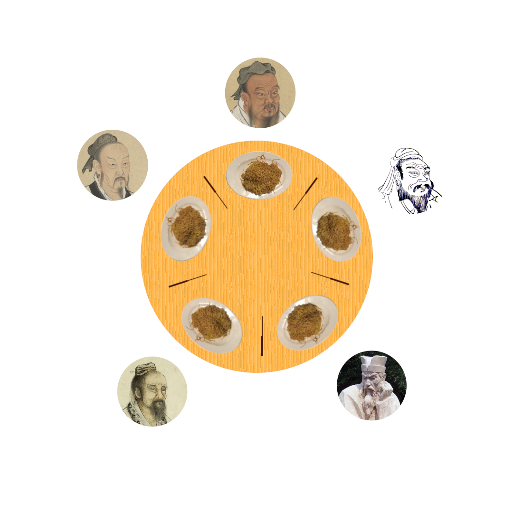

## Issues with concurrency
Running a program with several concurrent threads of execution can encounter several issues that are not present when running a single thread. These problems can include

* Deadlock: the system is locked, not doing any work and not changing state.
* Livelock: the system is apparently doing _something_, changing state, but no work is being done.
* Resource Starvation: one or more of the threads is unable to perform work, being unable to access a necessary resource.
* Race Condition: a thread ensures an action is possible, but this is not longer the case when the action is attempted, due to another thread.

## Dining Philosophers
A classical computer science analogy to illustrate issues with concurrency and resource contention.

### The set up
Five hungry yet contemplative philosophers are seated around a table. In front of each of them is a bowl of noodles. In between each of them is a single chopstick. The philosophers are holding one of their famous _symposia_, a party for eating and thinking. Each philosopher will alternate between thinking and eating. To eat, a philosopher needs to have hold of _both_ chopsticks. Crucially, this means that not all of the philosophers can eat at the same time.

 

A fuller explanation of the Dining Philosphers problem can be found on [Wikipedia](https://en.wikipedia.org/wiki/Dining_philosophers_problem).

## Deadlock
It is easy for the philosophers to get into what is called a deadlocked state. In the analogy, each philosopher is determined to eat, and picks up the chopstick to their right, and is unwilling to put it down until after they have eaten. They are each left holding exactly one chopstick each, and are also left hungry, each unwilling to put down the chopstick they have hold of.

In a concurrent computer system this same deadlock can also occur. If there are _n_ worker threads, each requesting two of _n_ resources, then they can easily end up in a state where each worker has one of the two resources they need, and no work is done. Because of this, the state is referred to as being locked. The computer system is also not changing state, so this is referred to as a deadlock.

### Try and wait
A simple solution to a deadlock is to implement a try-and-wait algorithm.

For the philosophers, this means trying to eat using both chopsticks. If they are, great!, they get to eat. If not, then put down any chopsticks you may have in hand, wait a period of time and repeat.

For the computer system, the procedure is very similar. Try to acquire the necessary resources, use them if available, otherwise free them for use by others and wait for some period of time before trying again.

In both cases, this breaks the time symmetry of the problem. No longer are all the workers or philosphers in the same state for ever more, something is changing, and work gets done.

## Livelock
Or does it? The try-and-wait algorithm might end up with all of the philosophers picking up one chopstick simultaneously, realising the other is not available, and putting it back down again without eating. They all wait for the same length of time, and try again.

This is called a livelock. Just like a deadlock, it is a situation in which no productive work is being done, hence a 'lock'. However, the state of the philosophers (or computer system) is continually changing, so it looks to an observer or program user that something is happening.

### Resource hierarchy
One factor that causes the livelock for our dining philosophers ist that the situation is still symmetric around the table. They can all perform the same action at and end up getting nowhere. A solution to this is to break the symmetry around the table. This can be done be introducing a resource hierarchy. In the case of the philosophers, they are labelled P1 to P5 around the table. The chopsticks are also labelled C1 to C5, so that philosopher P1 is seated between chopsticks C1 and C2, and so on around the table until philosopher P5, who is seated between chopsticks C5 and C1. The rules of the resource hierarchy then state that each philosopher can only pick up their higher numbered chopstick once they have picked up the lower numbered one.

 

How does this prevent the livelock? Each philosopher P*i* goes to pick up chopstick C*i*, except P5, who has to pick up C1 before C5. This means that P4 can now pick up both C4 and C5, eat and put down C4, allowing P3 to eat. Eventually P1 is able to eat using C1 and C2, places them down and P5 can finally eat.

## Resource starvation
This works well enough, unless philosopher P4 is once again holding C4 and C5 at the moment C1 becomes free. It could occur that P5 never gets to eat. In this case the worker thread equivalent to P5 is said to be suffering from resource starvation. While work get done (philosophers get fed), this situation is still far from ideal as it reduces the parallelism and overall throughput of the entire system.

## Race condition
Another problem that may occur in concurrent programs is that of race conditions. These occur when one thread checks if a resource is available, is interrupted by another that makes that resource unavailable, resumes and is unable to complete the intended action. The effect of this can be anything from starving one of the workers (as above) to causing the entire program or system to crash.

In the case of our philosophers, P3, wants to eat. They check that chopsticks C3 and C4 are available, and picks up C3. In the meantime, P4 has grabbed C4. What happens when P3 tries to pick up the chopstick that is no longer there? In the case of the philosophers, there would no doubt be a full and frank exchange of views. 

### Waiter/arbitrator
One solution that race conditions is to use an arbitrator for access to the contended resources. In the case of the dining philosophers, this can be thought of as a waiter whom the philosophers ask permission to pick up both their chopsticks. Only one is allowed to pick up chopsticks at a time, and the waiter will not allow another to attempt to do so until the previous philosopher has their chopsticks firmly in hand.

The waiter can also resolve the issue of resource starvation by ensuring that no philosopher is allowed to go too long without getting to pick up chopsticks and eat.

In a real computer system, the arbitrator will do much the same thing, controlling access by the worker threads to ensure that access is performed in an orderely fashion, and potentially preventing resource starvation.

In the case of the computer model of the dining philosophers, the arbitrator can be implemented as a mutex.

## Mutex
A mutex is an object that is shared between threads which allows only one thread to pass a certain point at any one time. The name is short for *mut*ual *ex*clusion, and might also be known as a lock.

A mutex protects access to what is known as a critical section to only one worker thread at a time. In the case of the dining philosophers, this critical section is the action of picking up chopsticks. The worker thread attempts to access the critical section. If no other worker is within, the mutex will allow the worker thread to proceed, perform the actions of the critical section and crucially to release the mutex lock when it is finished. This allows any other thread that might be waiting to proceed into the critical section.

### `std::mutex`
Introduced in C++11.

The `std::mutex` class provides a minimal, portable interface to the underlying operating system mutexes. It can be included in your code using the `#include <mutex>` standard header inclusion. The base C++ version provides the following member functions:
* `mutex( )`
  * default constructor
* `void lock( )`
  * locks the mutex, blocks the calling code if the mutex is not available
* `bool try_lock( )`
  * tries to lock the mutex, returning false if the mutex is not available
* `unlock( )`
  * unlocks the mutex

One important point to consider is that due to the usual implementation, `std::mutex`es cannot be used in a `std::vector` or any other container that requires move or copy semantics. This might seem an obvious way to store several mutexes restricting access to several critical sections, but will cause compilation errors when the compiler tries to generate the templated code for the `std::vector<std::mutex>` type.

## Atomicity
Another important concept in avoiding problems such as race conditions is atomicity. An atomic operation is one that cannot be interrupted. If our philosophers were able to atomically check and pickup both chopsticks, then there would never be a risk of a race condition.

An example of a race condition that is prevented by atomic operations is if two threads were trying to increment the value of the same location in memory. Most computers will increment a memory value by reading from the physical memory and storing the value in a register, running the increment operation on that register, and then writing the value back to the memory. If this operation is not atomic, thread 1 might read the value 2, store it and then get interrupted by thread 2. Thread 2, reads the value 2, increments it to 3, and stores that value to memory. Thread 1 then resumes, increments 2 to 3 and stores that value to memory. When two threads have each incremented that memory location by 1, the user might hope that the value has gone from 2 to 4, being incremented twice. As we can see, that is not what happened. An atomic increment operation would have prevented this.

### `std::atomic`
This is a template that ensures that access to a variable is atomic. It can be included in your code using the `#include <atomic>` standard header inclusion.

The header also includes atomic versions of the built-in `bool` and integer (`char`, `int`, `long`) types enforcing atomic access, arithmetic and incrementing.

## Other standard concurrency problems
The dining philosophers problem is just one of several used to illustrate issues that might occur in concurrent execution of a computer program. Others include:
* Cigarette smokers problem
* Producers-consumers problem
* Readers-writers problem
* Sleeping barber problem

For more details Wikipedia provides a good explanation of these problems at a level appropriate for this course. 
